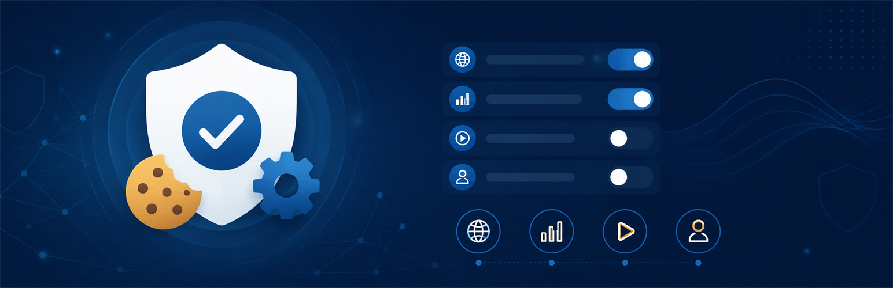
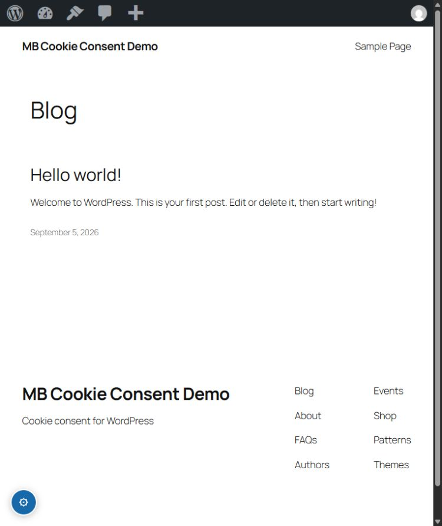
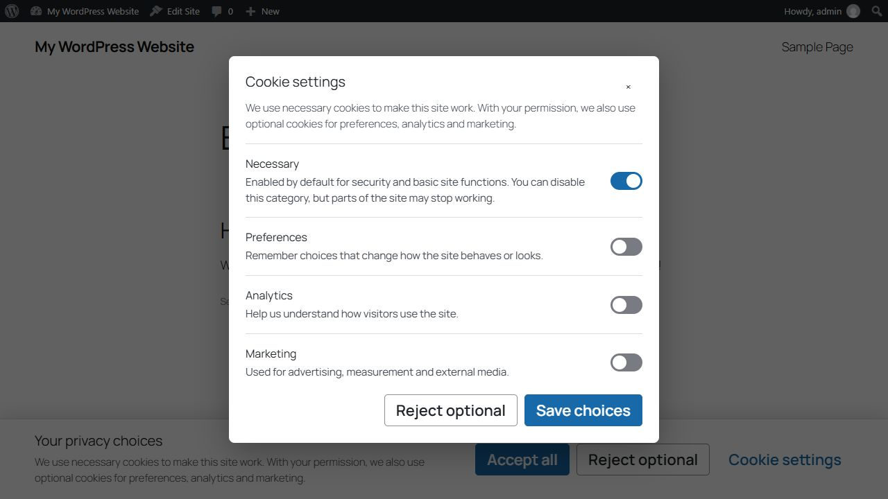
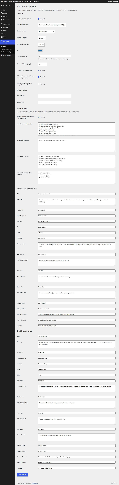
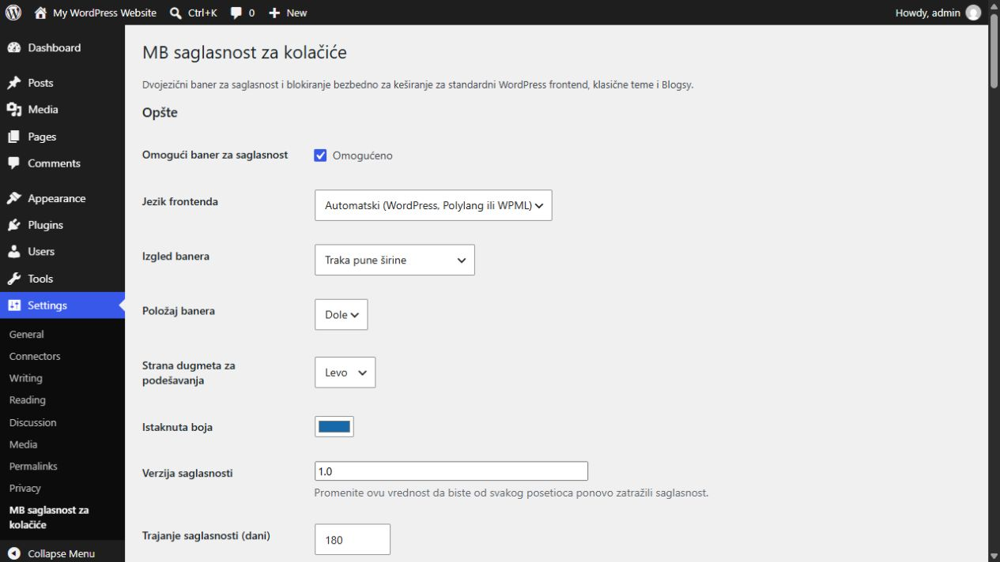
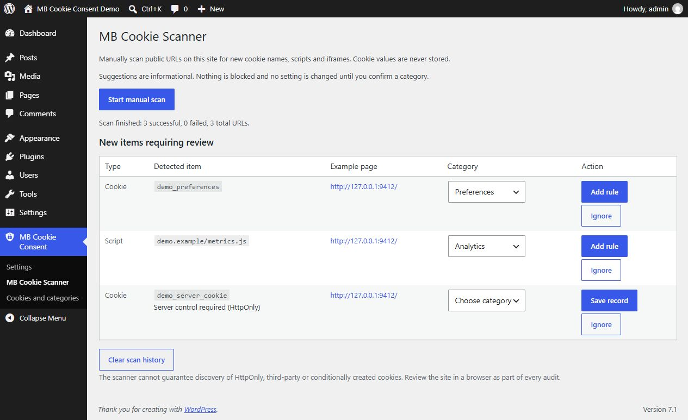
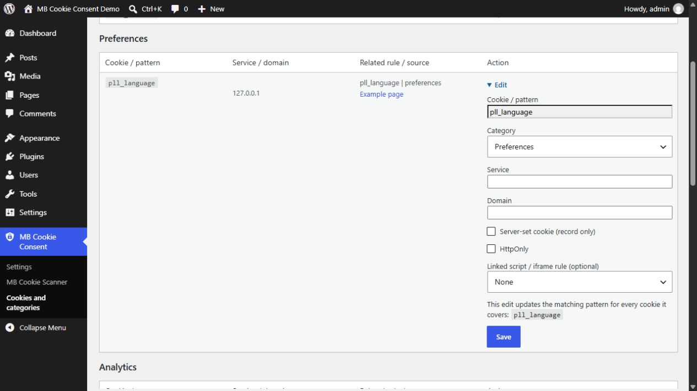
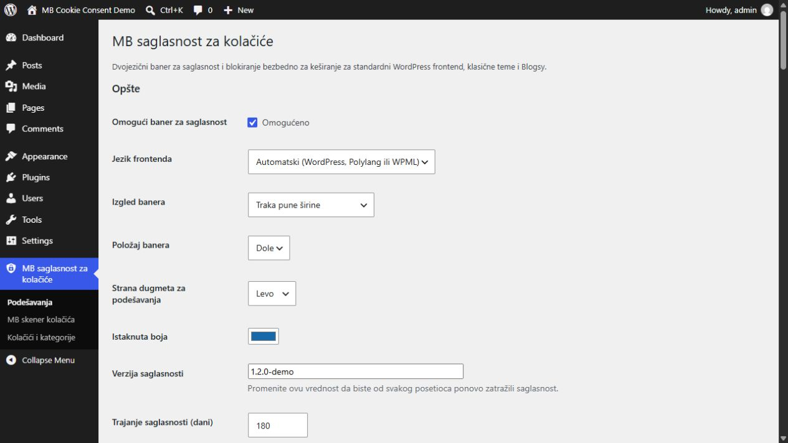

# MB Cookie Consent 1.2.0

## English

Standalone WordPress plugin providing a bilingual cookie banner and prior blocking of optional scripts. It is designed for standard and classic WordPress frontends.

### Features

- Serbian Latin and English;
- automatic WordPress, Polylang and WPML language detection;
- necessary, preferences, analytics and marketing categories;
- necessary is selected by default but can be disabled manually by the visitor;
- accept all, reject optional and granular choices;
- blocking by WordPress script handle and URL pattern;
- placeholders for YouTube, Vimeo and Google Maps;
- Google Consent Mode v2;
- four layouts: full-width bar or a floating card aligned left, right or centre;
- consent withdrawal/change control;
- `[mbcc_cookie_settings]` shortcode.
- manually started same-site scanner for new cookie names, scripts and iframes;
- conservative category suggestions with administrator-confirmed rule creation.
- one main admin menu with Settings, Scanner, and Cookies and categories submenus;
- grouped cookie inventory with Edit, manual records, service/domain metadata and optional links to existing resource rules;
- informational server/HttpOnly records marked “Server control required”.

### Installation and configuration

1. In WordPress Admin, open **Plugins → Add New → Upload Plugin**.
2. Select the ZIP, install it and activate the plugin.
3. Open **MB Cookie Consent → Settings** in the main admin menu.
4. Enter the Serbian and English privacy-policy URLs.
5. Review the script handle, URL, iframe and cookie rules.
6. Change `Consent version` when a policy update requires renewed consent.
7. Clear the page/optimization cache, CDN/Cloudflare cache and browser cache, then test in a private window.

### Cookie inventory and editing

Open **MB Cookie Consent → Cookies and categories**. The inventory combines recorded cookie names and configured cookie patterns under Necessary, Preferences, Analytics, Marketing and Unclassified. It is not a live list of cookies in each visitor's browser. Use **Edit** to choose a category and save service/domain details or link an existing script/iframe rule for reference.

For browser-cookie rules, saving updates the matching pattern in place and removes exact duplicates. Editing a cookie covered by `_ga*` changes that pattern for all covered names; the form explicitly shows this scope. Conflicting overlapping patterns must be resolved in Settings. Linked scripts retain their own category: edit their blocking rules separately when needed. The required `mbcc_consent` record cannot be reassigned.

Use **Add cookie record** for manual entries, including unclassified cookies. The manual scanner also records cookie names found in returned `Set-Cookie` headers, together with an observed Domain/HttpOnly flag when available. Server-set and HttpOnly records are informational: changing their category does not create blocking or deletion rules. Existing removal rules are not silently removed. Cookies with the same name are consolidated into one record with an example source; this is not a per-domain/path cookie database. Cookie values are never stored. Clearing scan history retains the inventory and configured rules.

After changing categories, review the linked service rules and optionally increase **Consent version** in Settings, clear page/CDN caches and repeat consent tests. Scanning remains manual (up to 250 public URLs, four per batch); there are no scheduled scans or notifications.

### Manual blocking

```html
<script
    type="text/plain"
    data-mbcc-category="analytics"
    data-mbcc-src="https://example.com/analytics.js"
></script>
```

Allowed categories are `preferences`, `analytics` and `marketing`.

### Important limitations

- The plugin does not automatically crawl the whole site.
- HttpOnly cookies cannot be removed by JavaScript. Server-set cookies may be recreated by the server; this release only inventories them and does not intercept their creation.
- The `mbcc_consent` cookie remains technically exempt so the visitor's selection can persist between pages.
- Disabling genuinely necessary cookies may break login, security, cart or other essential site functions.
- Dynamically injected scripts and proxied resources require a dedicated rule or integration change.
- JavaScript minification or delay can change handles and URLs, so rules should be retested after enabling optimization.
- A technical plugin is not a legal guarantee of compliance.
- The manual scanner does not execute JavaScript and cannot guarantee discovery of third-party, HttpOnly or conditionally created cookies.

## Srpski (latinica)

Samostalan WordPress dodatak za dvojezični baner za kolačiće i blokiranje opcionih skripti pre saglasnosti. Namenjen je standardnim i klasičnim WordPress frontendima.

### Funkcije

- srpski latinica i engleski;
- automatska detekcija WordPress, Polylang i WPML jezika;
- kategorije: neophodni, podešavanja, analitika i marketing;
- neophodni su podrazumevano uključeni, ali ih posetilac može ručno isključiti;
- prihvatanje svih, odbijanje opcionih i granularan izbor;
- blokiranje preko WordPress script handle-a i URL obrasca;
- YouTube, Vimeo i Google Maps placeholderi;
- Google Consent Mode v2;
- izbor izgleda: puna traka, plutajuća kartica levo, desno ili u sredini;
- povlačenje ili promena saglasnosti;
- shortcode `[mbcc_cookie_settings]`.
- ručno pokretanje skenera javnih URL-ova za nove nazive kolačića, skripte i iframe-ove;
- predlozi kategorija uz obaveznu potvrdu administratora pre dodavanja pravila.
- jedan glavni admin meni sa podmenijima Podešavanja, Skener i Kolačići i kategorije;
- grupisan pregled kolačića sa opcijom Izmeni, ručnim unosom i povezivanjem postojećeg pravila skripte;
- informativna evidencija serverskih/HttpOnly kolačića uz oznaku „Serverska kontrola potrebna“.

### Instalacija i podešavanje

1. U WordPress Adminu otvorite **Plugins → Add New → Upload Plugin**.
2. Izaberite ZIP, instalirajte i aktivirajte dodatak.
3. Otvorite **MB Cookie Consent → Podešavanja** u glavnom admin meniju.
4. Unesite srpski i engleski URL politike privatnosti.
5. Pregledajte script handle, URL, iframe i cookie pravila.
6. Promenite `Consent version` kada izmena politike zahteva novu saglasnost.
7. Očistite page/optimization cache, CDN/Cloudflare i browser cache, pa testirajte u privatnom prozoru.

### Pregled i izmena kategorija

Otvorite **MB Cookie Consent → Kolačići i kategorije**. Pregled objedinjuje evidentirane nazive kolačića i podešene obrasce u kategorijama Neophodni, Podešavanja, Analitika, Marketing i Neklasifikovani. To nije živa lista kolačića u pregledaču svakog posetioca. Opcija **Izmeni** omogućava izbor kategorije, unos servisa/domena i povezivanje postojećeg pravila skripte ili iframe-a radi pregleda.

Čuvanje menja postojeći odgovarajući obrazac i uklanja njegove identične duplikate. Ako kolačić pokriva `_ga*`, izmena važi za sve nazive obuhvaćene tim obrascem; forma prikazuje taj obuhvat. Konfliktne obrasce koji se preklapaju treba uskladiti u Podešavanjima. Kategorija povezane skripte menja se zasebno. Obavezni zapis `mbcc_consent` ne može se prebaciti u drugu kategoriju.

Opcija **Dodaj zapis kolačića** podržava ručno evidentiranje i nekategorisane stavke. Ručni skener evidentira nazive iz primljenih `Set-Cookie` zaglavlja, uz domen i HttpOnly oznaku kada su dostupni. Serverski i HttpOnly zapisi su informativni: promena kategorije ne dodaje pravila blokiranja ili brisanja. Postojeća pravila uklanjanja ne brišu se automatski. Isti naziv se objedinjuje u jedan zapis sa primerom izvora, bez posebnih zapisa za svaki domen/putanju. Vrednosti kolačića se ne čuvaju. Brisanje istorije skeniranja zadržava pregled kolačića i pravila.

Posle izmene pregledajte pravila povezanih servisa, po potrebi povećajte **Verziju saglasnosti**, očistite page/CDN keš i ponovite test prihvatanja i odbijanja. Skener se pokreće samo ručno, za najviše 250 javnih URL-ova u paketima po četiri; nema periodičnih skeniranja ni obaveštenja.

### Ručno blokiranje

```html
<script
    type="text/plain"
    data-mbcc-category="analytics"
    data-mbcc-src="https://example.com/analytics.js"
></script>
```

Dozvoljene kategorije su `preferences`, `analytics` i `marketing`.

### Važna ograničenja

- Dodatak ne skenira automatski ceo sajt.
- HttpOnly kolačići ne mogu se ukloniti JavaScriptom. Server može ponovo postaviti serverski kolačić; ova verzija ih evidentira i ne presreće njihovo postavljanje.
- Kolačić `mbcc_consent`, koji pamti izbor posetioca, ostaje tehnički izuzet; bez njega izbor ne može da se sačuva između stranica.
- Isključivanje stvarno neophodnih kolačića može prekinuti prijavu, bezbednost, korpu ili druge osnovne funkcije.
- Dinamički ubačene skripte i proxy URL-ovi zahtevaju posebno pravilo ili izmenu integracije.
- Minifikacija ili odlaganje JavaScripta može promeniti handle ili URL, pa pravila treba proveriti nakon uključivanja optimizacije.
- Tehnički dodatak ne predstavlja pravnu garanciju usklađenosti.
- Ručni skener ne izvršava JavaScript i ne može garantovati otkrivanje third-party, HttpOnly ili uslovno napravljenih kolačića.

## Screenshots

Captured from MB Cookie Consent 1.2.0 in a local WordPress demo. Scanner findings and inventory entries are illustrative demo data, not production audit results.

### Consent banner



### Granular cookie settings



### Administration settings and unified menu



### Cookie inventory and editing



### Manual scanner



### Edit a cookie record



### Administratorska podešavanja na srpskom



## Changelog

### Unreleased — consent validation and scanner resilience

- EN: Script and iframe reactivation accepts only valid HTTP(S) URLs, including relative URLs. Rejected sources remain blocked and never fall back to inline execution.
- SR: Reaktivacija skripti i iframe elemenata prihvata samo ispravne HTTP(S) adrese, uključujući relativne. Odbijeni izvori ostaju blokirani bez izvršavanja inline sadržaja.
- EN: Keep scan findings when cookie inventory is full or cannot be saved; report inventory warnings separately from failed URLs. Reject unrepresentable rule delimiters without discarding findings.
- SR: Sačuvani nalazi kada je evidencija puna ili upis ne uspe, uz odvojena upozorenja. Neispravni razdvajači pravila odbijaju se bez gubitka nalaza.
- EN: Strict boolean consent validation in both readers; stale or malformed consent starts with optional categories off. Inline module activation waits for load/error before continuing.
- SR: Stroga validacija saglasnosti u oba čitača; stara ili neispravna saglasnost ne uključuje opcione kategorije. Aktivacija inline modula čeka završetak učitavanja ili grešku.
- Verification: isolated regressions, including `node tests/consent-readers-regression.cjs` (set `PHP_BINARY` if PHP is not on PATH). These checks do not replace browser/staging verification.

### 1.2.0 — Unified menu and cookie inventory / objedinjeni meni i pregled kolačića

- EN: One main menu with Settings, Scanner, and Cookies and categories; corrected scanner assets and admin links.
- SR: Jedan glavni meni sa podmenijima Podešavanja, Skener i Kolačići i kategorije, uz ispravne admin linkove.
- EN: Manual cookie records, category editing without duplicate rules, linked resource-rule references, stale-form protection and preserved site settings.
- SR: Ručni zapisi, izmena kategorija bez dupliranja pravila, povezivanje pravila servisa i zaštita zastarelih formi.
- EN/SR: Server/HttpOnly metadata is informational only / serverski i HttpOnly podaci služe samo za evidenciju.
- Includes the previously unreleased 1.1.1 fixes below. / Uključuje prethodno neobjavljene ispravke 1.1.1 navedene ispod.

### 1.1.1 — Blocker and scanner fixes

- Validate actual blocking attributes and skip text-element contents when locating scripts.
- Share attribute/context parsing with the scanner; preserve URL ports.
- Retain findings when rule saving fails and show successful/failed scan counts with failed URLs.
- Add regression coverage for parser bypasses, scanner discovery, authorization and persistence failures.


### 1.1.0 — Manual cookie audit / ručni pregled kolačića

- Fixes quoted tag boundaries and quoted/unquoted script and iframe attributes; preserves module type and source through consent activation.
- Adds a manually started scanner for up to 250 public URLs on the site's own domain, processed in small batches.
- Records cookie names and normalized script/iframe patterns without storing cookie values.
- Suggests a category but requires an administrator to confirm it before adding a rule.
- Includes no scheduled scanning, browser automation or notifications.

### 1.0.7 — Necessary-cookie description / opis neophodnih kolačića

- EN: Replaces the obsolete “cannot be disabled” wording with an explanation matching the configurable necessary-category switch.
- SR: Zastareli tekst „Ne mogu se isključiti” zamenjen je jasnim objašnjenjem da su neophodni kolačići podrazumevano uključeni, ali da ih posetilac može isključiti uz moguć gubitak pojedinih funkcija sajta.
- EN/SR: Existing installations update only the exact legacy stock text; customized content remains untouched. / Na postojećim instalacijama menja se samo identičan stari podrazumevani tekst; prilagođeni sadržaj ostaje netaknut.

### 1.0.6 — WordPress.org preparation / priprema

- EN: WordPress.org metadata, privacy documentation and directory listing assets are prepared.
- SR: Ažurirani su WordPress.org metapodaci, dokumentacija privatnosti i listing resursi.
- EN: A POT catalogue and a complete `sr_RS_latin` WordPress Admin translation are included. English remains the source language.
- SR: Dodat je POT katalog i kompletan prevod WordPress Admin interfejsa za `sr_RS_latin`. Engleski ostaje izvorni jezik.

### 1.0.5 — Google Site Kit defaults / podrazumevana pravila

- Google Tag (`googletagmanager.com/gtag/js`) and the Google Site Kit events provider are blocked as analytics by default until consent.
- Existing installations receive only missing rules once. Custom rules and categories, other settings and existing consent records remain unchanged.
- Google Ads `AW-` patterns remain classified as marketing.

### 1.0.4 — Frontend fixes / ispravke

- Initialization waits for DOM readiness so the floating settings control works without a script-delay plugin; scripts loaded after DOM readiness initialize immediately.
- The consent runtime and its inline configuration (`MBCC_CONFIG`) are exempt from MBCC blocking, including accidental matches from custom rules.
- Existing settings and consent records remain unchanged. Includes all 1.0.3 fixes.

#### Polylang and optimization plugins

- WordPress script handle: `pll_cookie_script|preferences`
- Cookie removed after rejection: `pll_language|preferences`
- Do not add the Polylang handle to Script URL patterns. URL patterns also search inline script contents.
- Test without WP Meteor or other optimizers first: they may reactivate blocked scripts. This release does not guarantee compatibility with rewritten HTML.
- Clear page, CDN and browser caches after updating.

### 1.0.3 — Cookie removal and settings autoload

- Cookie removal attempts all parent domains, including multipart suffixes and nested subdomains. The browser rejects public-suffix attempts; no manually maintained TLD list is used.
- `mbcc_settings` is autoloaded. Existing installations are migrated on the next administrator dashboard request without changing saved settings or consent records.
- Removal remains limited to configured, JavaScript-accessible cookies at path `/`. HttpOnly cookies, other paths and unrelated third-party domains are outside this fix.

## Verification

Earlier builds have been tested in staging and production environments. These historical checks do not by themselves certify the new 1.2.0 inventory UI. The following checks were performed:

### Staging and production

- first visit in a private browser window, including opening the initial banner and granular cookie-settings dialog;
- accepting all, rejecting optional cookies and saving individual category choices;
- persistence of consent after page reload and reopening the dialog from the floating settings button;
- Serbian Latin and English frontend presentation, plus the Serbian Latin WordPress Admin translation;
- rejection and removal of the Polylang `pll_language` preference cookie while retaining only the technically required `mbcc_consent` cookie;
- blocking Google Tag and Google Site Kit analytics scripts before analytics consent, then releasing them after analytics is allowed;
- operation with Cloudflare and Super Page Cache after clearing page, CDN and browser caches;
- the banner, granular dialog and floating settings control on the production Blogsy frontend.

Browser tracking protection may independently block analytics requests even after consent; that browser behavior is separate from the plugin's consent decision.

### Automated developer checks

For 1.2.0, disposable WordPress Playground runs passed on WordPress **6.4.10 / PHP 7.4.33** and **7.1 / PHP 8.1.34**: activation, the three submenu registrations, inventory rendering, scanner asset loading, real-database category edits, server-only records and repeated scanning without duplicate or reappearing reviewed items. Plugin Check reported no errors or warnings after fixes. A narrow documented PHPCS exclusion retains `load_plugin_textdomain()` for bundled translations in private GitHub ZIP installations. These local checks are separate from the historical site tests above.

- PHP syntax validation for every shipped PHP file;
- `php tests/blocker-regression.php` for runtime/configuration protection, Polylang blocking, quoted/unquoted attributes, quoted `>`, duplicate attributes, module metadata and idempotency;
- `php tests/settings-rules-regression.php` for default-rule precedence, preservation of custom settings, the 1.0.7 text migration, administrator authorization and migration idempotency;
- `php tests/scanner-state-regression.php` verifies rule-write failures, authorization and persisted failed-URL summaries;
- `php tests/scanner-regression.php` for cookie-name extraction, resource normalization and conservative category suggestions;
- `php tests/cookies-regression.php` for editing, wildcard scope, duplicate prevention, metadata-only server records, rescan preservation, authorization, stale forms and write failures;
- `node tests/frontend-regression.cjs` for loading, interactive and complete document states, open/close/reopen/save flows, and external module type/source restoration with consent allowed and denied;
- JavaScript syntax validation for `assets/js/frontend.js`;
- activation and settings-page runtime checks on WordPress 6.4 with PHP 7.4 and WordPress 7.1 with PHP 8.1;
- WordPress Plugin Check with all error and warning categories enabled;
- release ZIP inspection for version metadata, expected root directory and exclusion of repository/development-only files.

The standalone regression tests use WordPress/DOM doubles and are excluded from the installation ZIP. The user also confirmed manual scanning and Add rule on their site, plus Edge first-visit, accept-all and analytics withdrawal behavior in the preceding build. The new 1.2.0 menu and inventory require a site-specific staging check before production deployment.
